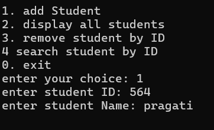
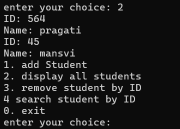
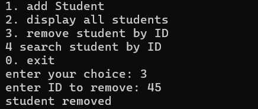
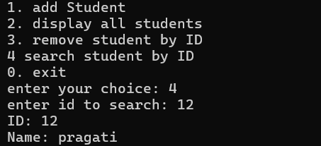

# 🎓 Student Management Template — C++ 

> 📘 “An idea I turned into code — this project helped me bridge classroom concepts with real coding logic.”


Hi, I’m **Pragati Ahir** 👩‍💻 and this is one of my favorite beginner-friendly C++ projects. It helped me understand templates, vectors, logic, and how to design clean terminal-based apps.

---
## 👀 Project in Action

<table>
  <tr>
    <td align="center">
      <br/>
      <em>➕ Add Student Form</em>
    </td>
    <td align="center">
      <br/>
      <em>📋 Displaying Student List</em>
    </td>
  </tr>
  <tr>
    <td align="center">
      <br/>
      <em>❌ Remove Student by ID</em>
    </td>
    <td align="center">
      <br/>
      <em>🔍 Search Student by ID</em>
    </td>
  </tr>
</table>


## ✨ Features

🌟 Add, view, search, and delete students using simple commands  
🌟 Uses **template class** to handle different data types  
🌟 Based on **STL vector** — no array limits  
🌟 Perfect for terminal practice  
🌟 Minimal & super clean code ✨

---

## 🔧 Technologies Used

- 💻 Language: C++  
- 📦 STL Components: `vector`, `iostream`  
- 🔄 Logic: Template Class + Dynamic List  
- 🖥️ Interface: CLI (Command Line)

---

## 🧠 A Peek into the Code

```cpp
template <typename T>
class MemoryCalculate {
public:
    T id;
    string name;

    MemoryCalculate(T i, string n) {
        id = i;
        name = n;
    }

    void showDetails() {
        cout << "ID: " << id << endl;
        cout << "Name: " << name << endl;
    }
};
